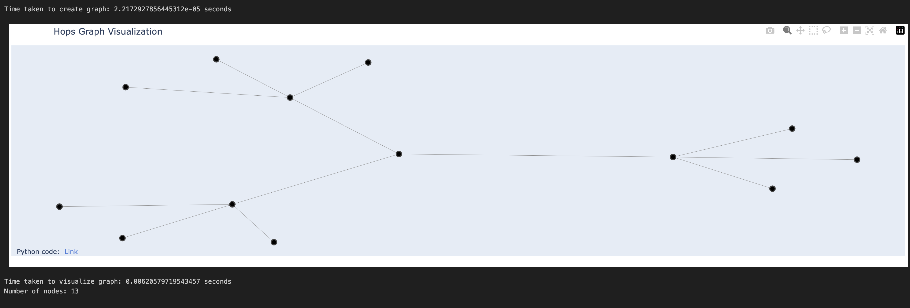

# Hops-Graph-Visualization

This Jupyter Notebook generates and visualizes a hops graph based on user input. The hops graph starts from a single node 'A' and extends to multiple nodes based on the number of hops specified by the user. It uses NetworkX and Plotly libraries for graph generation and visualization, providing an interactive and detailed representation of the hops graph.

## How to Use

1. Clone the repository to your local machine:

    ```
    git clone https://github.com/hemangsharma/Hops-Graph-Visualization
    ```

2. Install the required Python packages:

    ```
    pip install networkx matplotlib plotly
    ```

3. Run the jupyter notebook `hops_graph.ipynb`:

    ```
    hops_graph.ipynb
    ```

4. Enter the number of hops when prompted. The script will generate and display the hops graph along with the time taken for creation and visualization.

## Example

Here is an example of a hops graph visualization when entering '2':



## Contributors

- [Hemang Sharma](https://github.com/hemangsharma)

Feel free to contribute to this project by submitting issues or pull requests.

